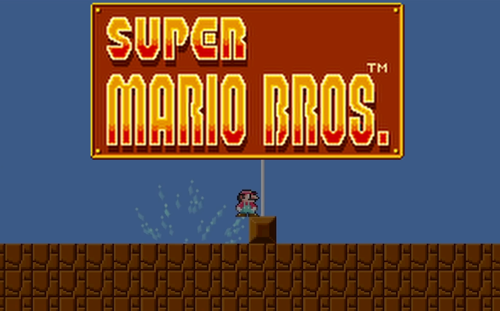
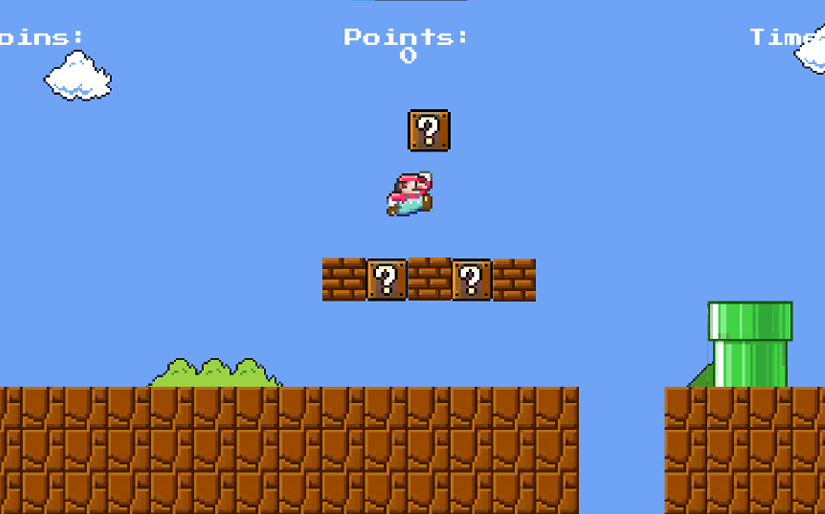
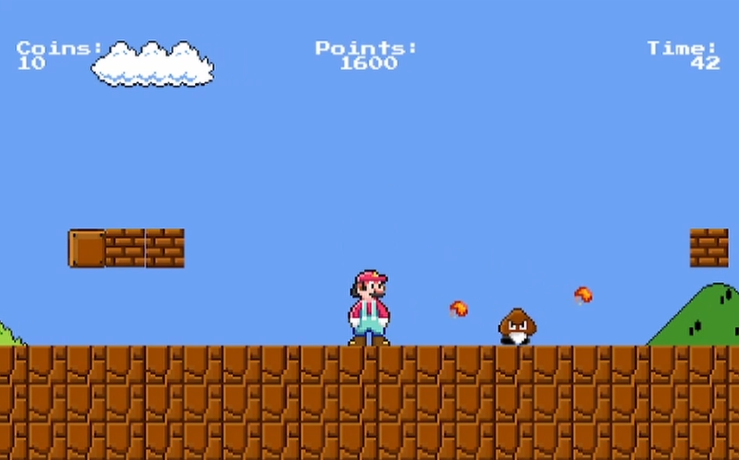

# Super Mario Unity Game

## Overview

https://www.youtube.com/watch?v=zrXJ84A1GdQ

https://www.youtube.com/watch?v=Gfb84kbpo2Q

This Unity project is a simple clone of the classic Super Mario game, showcasing basic mechanics like character movement, jumping, enemy interaction, collisions, animations, and level progression. You can run it on Windows. **Complete it to see the credits and other cool things!!**

## Features

- **Player Controls:** Utilize arrow keys for movement and spacebar for jumping or you can use an Xbox controller (left stick for the movement, A for the jump and Y for the firepower).
- **Enemy Interactions:** Stomp on Goombas to defeat them and defeat the red Goomba, it will follow you.
- **Level Progression:** Traverse through the level while avoiding obstacles and reaching the end flagpole.
- **Death & Restart:** Player dies on collision with certain objects and respawns at some certain places if they have reached it.
- **UI Elements:** Displays information such as the number of coins, the points and the time.
- **Camera Follow:** Camera follows the player within defined boundaries.

## Setup

1. **Unity Version:** Ensure you're using Unity 2022.3.1.10f1.
2. **Clone or Download:** Clone this repository or download the ZIP file.
3. **Open in Unity:** Open the project in Unity by selecting the root folder.
4. **Scene Selection:** Choose the starting scene by navigating to the scenes folder.

## Gameplay Instructions

- **Movement:** Use arrow keys (left and right) to move the player character or the left stick if you are using a joystick.
- **Jumping:** Press the spacebar to make the character jump or press A on your controller.
- **Firepower:** Press F to use the fire power or press Y on the controller.
- **Goal:** Navigate through the level, defeat enemies, and reach the end flagpole.

## Additional Features

### 1. **Main Menu:**
Upon launching the game, players are greeted with a Main Menu that allows them to start playing, access settings, view credits, and exit the game. The menu provides an intuitive and user-friendly interface.

### 2. **Multiple Levels:**
The game features two unique levels with distinct challenges, enemies, and environments. Players progress from one level to the next, adding variety to the gameplay experience.

### 3. **Credits Screen:**
The Credits screen acknowledges the contributions of individuals and resources used in the development of the game. It includes a visually appealing layout with scrolling text and background music.

## Project Structure

- **Scripts:** Contains various scripts controlling player behavior, enemy interactions, camera follow, game over, etc.
- **Prefabs:** Includes prefabs for player character, enemies, and other interactable objects.
- **Scenes:** Different scenes representing levels or game states.

## Credits

- **Sprites & Animations:** Sprites and animations were obtained from https://dotstudio.itch.io/super-mario-1-remade-assets, Super Mario Bros. (NES) and Super Mario All-Stars (SNES).
- **Sounds:** Sound effects used in the game were from the original Super Mario Bros. (NES), Super Mario All-Stars (SNES) and Tetris DS (Nintendo DS).
- **Font** Commodore 64 font was obtained from https://www.dafont.com/commodore-64.font.
